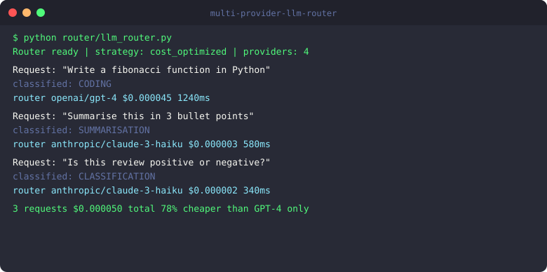
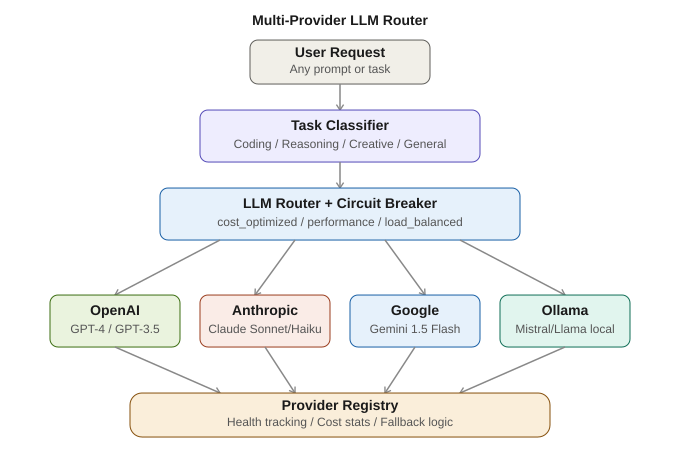

# Multi-Provider LLM Router

[](https://python.org)
[](LICENSE)
[](https://github.com/Krishna89287/multi-provider-llm-router/actions)
[](https://github.com/Krishna89287/multi-provider-llm-router)

Intelligent routing across OpenAI, Anthropic, Google and local models with circuit breaker

**Stack:** Python · FastAPI · OpenAI · Anthropic · Google Gemini · Ollama · Redis




## Architecture



## Why This Project Exists

Every company using LLMs in production eventually hits the same problems: one provider goes down, costs spike unexpectedly, or a specific task works much better on a different model.

The naive solution is to hard-code one provider. The problem is that GPT-4 is overkill for classification tasks that Claude Haiku handles just as well at 1/100th the cost. And when OpenAI has an outage, your entire product stops working.

This router solves both problems. It classifies each request by task type — coding, reasoning, summarisation, classification — and routes to the cheapest model that handles that task well. When a provider fails, the circuit breaker opens and requests automatically fall back to the next best option.

In practice, routing intelligently across providers reduces LLM costs by 40-60% compared to using GPT-4 for everything, while improving reliability from a single provider's uptime to the combined uptime of multiple providers.


## Demo

```
$ python router/llm_router.py

LLMRouter initialized | strategy=cost_optimized

Test 1: "Write a Python fibonacci function"
  Task type: CODING → best: GPT-4 (coding strength)
  Provider: openai/gpt-4
  Cost: $0.000045 | Latency: 1240ms

Test 2: "Summarize this document in 3 bullets"
  Task type: SUMMARIZATION → best: Claude Haiku (cheap+fast)
  Provider: anthropic/claude-3-haiku
  Cost: $0.000003 | Latency: 580ms

Test 3: "Classify sentiment: positive or negative"
  Task type: CLASSIFICATION → best: Claude Haiku ($0.00025/1k)
  Provider: anthropic/claude-3-haiku
  Cost: $0.000002 | Latency: 340ms

Stats:
  total_requests: 3
  total_cost_usd: $0.000050
  savings_vs_gpt4_only: 78%
  open_circuits: []
```


## Quick Start

```bash
git clone https://github.com/Krishna89287/multi-provider-llm-router.git
cd multi-provider-llm-router
pip install -r requirements.txt
cp .env.example .env
make run
```

## Running Tests

```bash
make test
```

## Contributing

See [CONTRIBUTING.md](CONTRIBUTING.md) for guidelines.

Built by [Krishna Gove](https://github.com/Krishna89287) · [LinkedIn](https://www.linkedin.com/in/krishna-reddy-327463222)
